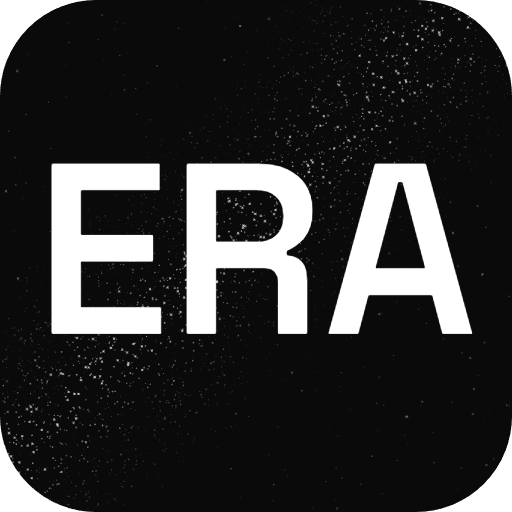

<h1 align="center">Hey, I'm Victor 👋</h1>

  <strong>Backend &amp; Infrastructure Engineer</strong>

  <a href="https://vikgmdev.com">vikgmdev.com</a>

  
  

---

Backend engineer working mostly in Node.js, TypeScript and Kubernetes. Everything below is a personal side project, built on my own time.

## Side projects

### 🔮 [ERA](https://eraastrology.ai)

Cosmobiology app, live on [Google Play](https://play.google.com/store/apps/details?id=ai.eraastrology.app). Built on a methodology transmitted directly from my father, Hector García, an astrologer with 30+ years of practice.

  

### 💻 [Forgetty](https://forgetty.dev)

GTK4 terminal emulator written in Rust. MIT licensed, source at [github.com/vikgmdev/forgetty](https://github.com/vikgmdev/forgetty). Daemon-first architecture, tabs and split panes, session restore, socket API.

## Stack

  

  

---

  Profile scaffolding inspired by the open-source <a href="https://github.com/santifer/career-ops">career-ops</a> by <a href="https://github.com/santifer">@santifer</a>. Thank you for the blueprint 🙏

